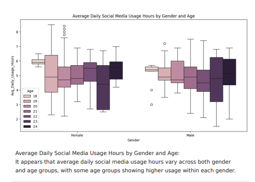
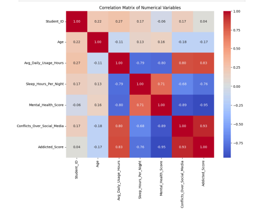
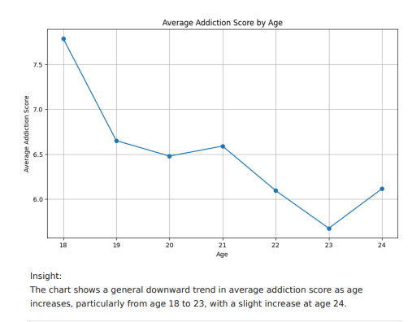

# social-media-addiction-analysis
EDA &amp; insights project using Python, Pandas, Matplotlib
📊 Combating Social Media Addiction with Data-Driven Insights


🔹 Overview

This project explores student social media usage patterns and their impact on sleep, mental health, and academic performance. Using Python and data visualization, I analyzed trends, identified addiction risks, and suggested data-driven strategies for digital wellness.

🔹 Objectives

Perform EDA (Exploratory Data Analysis) to uncover trends in social media usage

Identify correlations between usage hours, conflicts, sleep patterns, and mental health

Classify addiction risk levels using custom functions

Provide digital detox strategies based on insights

Create visualizations and a storytelling summary for awareness

🔹 Tools & Technologies

Python (Pandas, NumPy, Matplotlib, Seaborn)

Google Colab

Gemini Gen AI (for assistance in analysis & storytelling)

🔹 Key Insights

📈 Higher social media usage strongly correlates with reduced sleep and lower mental health scores

🎯 High school students showed the highest average addiction scores

🔍 Average addiction decreases as age increases, with some exceptions

📱 Instagram & TikTok account for the majority of usage hours

🔹 Visualizations

Addiction Score by Age, Gender & Academic Level

Sleep Hours vs Academic Performance

Platform Usage Distribution (Pie Chart)

Correlation Heatmap of numerical variables

🔹 Project Structure

Combating_Social_Media_Addiction_with_Data_Driven_Insights.ipynb → Notebook with full code & analysis

Combating_Social_Media_Addiction_with_Data_Driven_Insights.pdf → Report with outputs & insights

Python Mini Project - Social Media Combat.pdf → Original project document with tasks & guidelines
## Key Insights
- **Higher usage → worse sleep & mental health:** Higher daily social media usage strongly correlates with reduced sleep hours and lower mental health scores.
- **Younger students at greater risk:** High school students show the highest average addiction scores.
- **Platform concentration:** Instagram and TikTok account for most usage hours.
- **Usage & conflicts:** Higher usage correlates with more conflicts over social media and lower academic performance.

  “How to Run” section
  ## How to Run

### Option A — Open in Google Colab (recommended)
1. Open this notebook in Colab:  
   `https://colab.research.google.com/github/Rishi5225/social-media-addiction-analysis/blob/main/Combating_Social_Media_Addiction_with_Data_Driven_Insights.ipynb`
2. Click **Runtime → Run all** to execute all cells.

### Option B — Run locally
```bash
git clone https://github.com/Rishi5225/social-media-addiction-analysis.git
cd social-media-addiction-analysis
pip install pandas numpy matplotlib seaborn
jupyter notebook
# then open the notebook file and run cells

```
## Visualizations

### Box Plot — Social Media Usage by Gender & Age


### Heatmap — Correlation of Variables


### Line Chart — Addiction Score by Age



